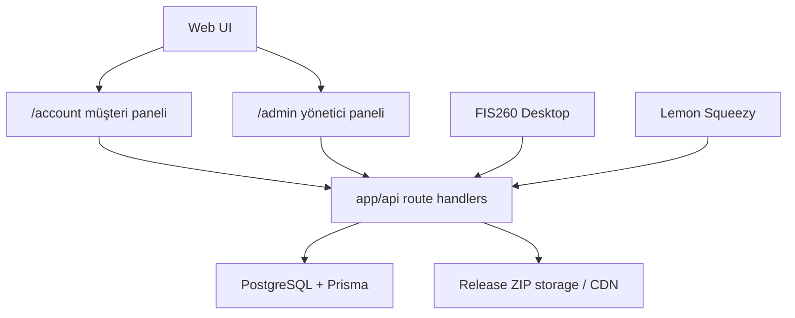

# imlec-site v0.1.0 Seyir Defteri

Tarih: 2026-06-04  
Kapsam: İmleç Yazılım web platformu, üyelik, admin panel, desktop auth, entitlement, güncelleme, kampanya, destek bildirimi ve Lemon Squeezy ödeme altyapısı.

---

## 1. Platform Tanımı

`imlec-site`, İmleç Yazılım ürünlerinin web, hesap, ödeme, lisans ve müşteri yönetim platformudur.

Bu sürümde ana ürün FIS260'dır. FIS260 masaüstü uygulaması:

- login,
- entitlement kontrolü,
- cihaz kaydı,
- offline çalışma toleransı,
- güncelleme bilgisi,
- destek bildirimi

için `imlec-site` API'lerini kullanır.

---

## 2. Teknoloji Yığını

| Katman | Teknoloji |
|---|---|
| Web framework | Next.js App Router |
| Dil | TypeScript |
| Auth | NextAuth credentials + JWT session |
| ORM | Prisma |
| Veritabanı | PostgreSQL |
| Ödeme altyapısı | Lemon Squeezy entegrasyonu |
| Email | Resend / React Email |
| UI | React, Tailwind, lucide-react |
| Deploy hedefi | Vercel uyumlu modular monolith |

---

## 3. Ana Mimari



Bu aşamada ayrı backend yoktur. Next.js route handler'ları hem web hem desktop API görevini üstlenir. Bu karar erken aşama ürün için operasyonu sade tutmak amacıyla alınmıştır.

---

## 4. Veri Modeli

Ana modeller `prisma/schema.prisma` içindedir.

### 4.1 User

Kullanıcı hesabını temsil eder.

Bağlı olduğu alanlar:

- web sessions
- desktop sessions
- subscriptions
- entitlements
- devices
- payments
- invoices
- access requests
- support tickets
- organization memberships

### 4.2 Product

Platformdaki ürünleri temsil eder.

Bu sürümde ana ürün:

```text
slug: fis260
name: FİŞ260
```

### 4.3 Entitlement

Ürüne erişim hakkını temsil eder.

FIS260 masaüstü uygulamasının çalışıp çalışmayacağı bu tabloya bağlıdır.

Kaynaklar:

- `SUBSCRIPTION`
- `TRIAL`
- `ADMIN`
- `MANUAL`
- `LEMON_SQUEEZY`

Kritik karar:

Ödeme sistemi, kampanya sistemi ve manuel admin grant farklı kaynaklardan entitlement üretebilir; desktop uygulama bunların hepsini tek erişim katmanı olarak görür.

### 4.4 Device

Masaüstü cihaz kaydını temsil eder.

Alanlar:

- userId
- productId
- fingerprintHash
- deviceName
- os
- appVersion
- status
- lastSeenAt
- trustedUntil
- revokedAt

Amaç:

- lisans paylaşımını sınırlamak,
- 2-3 cihaz sınırı uygulamak,
- müşteriyi kilitlemeden eski cihazını kaldırabilmesini sağlamak.

### 4.5 ProductVersion

FIS260 güncelleme sistemi için son sürüm bilgisini tutar.

Alanlar:

- version
- minimumVersion
- releaseNotes
- filePath
- sha256

FIS260 `/api/version/fis260` endpoint'inden bu bilgiyi okur.

### 4.6 SupportTicket / SupportAttachment

Müşterinin FIS260 içinden gönderdiği fiş hata bildirimlerini tutar.

Ticket:

- userId
- productSlug
- appVersion
- issueType
- message
- status
- sourceFileName
- systemSummary

Attachment:

- receipt image
- result JSON

İlk sürümde dosyalar DB `Bytes` olarak saklanır. Hacim artarsa Cloudflare R2/S3 gibi object storage'a taşınacaktır.

---

## 5. Auth ve Desktop Login

Web tarafında kullanıcı girişi NextAuth credentials ile yapılır.

FIS260 desktop akışı:

1. Kullanıcı FIS260 login ekranında email/şifre girer.
2. Desktop login API token üretir.
3. Desktop uygulama token'ı saklayabilir.
4. Cihaz register endpoint'i cihaz fingerprint kaydı açar.
5. Entitlement endpoint'i ürün erişimini ve cihaz durumunu doğrular.

İlgili endpointler:

- `/api/desktop-auth/login`
- `/api/desktop-auth/device/register`
- `/api/desktop-auth/entitlement`
- `/api/desktop-auth/ping`

Offline tolerans:

- Başarılı online doğrulama sonrası cihaz `trustedUntil` alır.
- Varsayılan offline grace 7 gündür.
- Amaç müşteriyi geçici internet probleminde kilitlememektir.

---

## 6. Admin Panel

Admin panel `/admin` altındadır.

Roller:

- `OWNER`
- `ADMIN`
- `SUPPORT`
- `USER`

Bu sürümde karar:

- `OWNER`, `ADMIN`, `SUPPORT` paneli görebilir.
- Yazma/değiştirme yetkisi sadece `OWNER` ve `ADMIN`.
- `SUPPORT` müşteri destek için okuyabilir ama erişim, kampanya, cihaz, duyuru gibi kritik kayıtları değiştiremez.

Admin ekranları:

- Kullanıcılar
- Kullanıcı detayları
- Duyurular
- Lemon Squeezy kayıtları
- Sürümler
- Kampanyalar
- Şirketler
- Destek bildirimleri

---

## 7. Kampanya Sistemi

Bu sürümde kampanya paneli migration açmadan, mevcut `Entitlement` modeli üzerinden çalışacak şekilde tasarlandı.

Kampanya türleri:

- 7 gün ücretsiz deneme
- 14 gün elde tutma
- 30 gün telafi

Akış:

1. Admin kampanya panelinden kullanıcı e-postası seçer.
2. Ürün seçer.
3. Kampanya tipi ve gün sayısı belirler.
4. Entitlement aktif hale getirilir veya süresi uzatılır.
5. İşlem admin log'a yazılır.

Önemli karar:

Bu kampanya sadece erişim hakkını etkiler. Eğer kullanıcı aktif Lemon Squeezy aboneliğine sahipse ödeme tarihini otomatik ertelemez. Aktif abonelik ödeme ertelemesi Lemon Squeezy tarafında ayrıca yönetilmelidir.

---

## 8. Güncelleme Sistemi

FIS260 uygulaması şu endpoint'i okur:

```text
/api/version/fis260
```

Endpoint döndürür:

- latest
- minimum
- releaseNotes
- downloadUrl
- sha256
- releasedAt

`filePath` tam URL ise direkt kullanılır. Göreli path ise `/downloads/<filePath>` URL'sine çevrilir.

Operasyonel karar:

456 MB civarı FIS260 ZIP dosyası site reposuna konmamalıdır. Cloudflare R2, S3 veya benzeri storage/CDN kullanılmalıdır. Admin sürüm panelinde `filePath` alanına tam URL yazmak en temiz yoldur.

---

## 9. Destek Bildirimi Sistemi

FIS260 içinden müşteri bir fişi seçip birkaç cümle yazar. Site tarafı bunu `/api/support/tickets` endpoint'i ile alır.

Gönderilenler:

- desktop token ile kullanıcı kimliği
- appVersion
- issueType: müşteri bildirimi
- message
- fiş görseli
- sistem özeti
- result JSON

Admin panelde:

- `/admin/support`
- `/admin/support/[ticketId]`
- `/api/admin/support/attachments/[attachmentId]`

Amaç:

- müşteri teknik detayla uğraşmasın,
- geliştirici gerçek fişi görsün,
- eski sürüm kullanan kullanıcı tespit edilsin,
- cins fişler geliştirme setine alınabilsin.

---

## 10. Lemon Squeezy Ödeme Altyapısı

Hazır bileşenler:

- `/api/webhooks/lemonsqueezy`
- webhook imza doğrulama
- duplicate event guard
- subscription upsert
- customer upsert
- entitlement activate/revoke
- license kaydı
- ödeme başarı/başarısız email taslakları
- admin Lemon Squeezy izleme paneli

Eksik veya canlı öncesi tamamlanacaklar:

- gerçek Lemon Squeezy store/variant/checkout URL
- webhook secret production env
- Payment tablosuna tam ödeme kaydı yazılması
- fatura/e-arşiv entegratörü seçimi
- Invoice tablosunun gerçek fatura PDF/XML linkleriyle doldurulması

---

## 11. Fatura ve Muhasebe Entegrasyonu

Bu sürümde fatura modeli hazırdır ama entegratör bağlanmamıştır.

Beklenen akış:

1. Lemon Squeezy ödeme başarılı webhook gönderir.
2. Payment kaydı oluşturulur.
3. Seçilecek e-fatura/e-arşiv entegratörüne API çağrısı yapılır.
4. Fatura PDF/XML linki alınır.
5. Invoice tablosuna yazılır.
6. Müşteri `/account/billing` ekranında faturayı görür.

Muhasebeciden alınacak kararlar:

- hangi entegratör
- test ortamı var mı
- bireysel e-arşiv / kurumsal e-fatura ayrımı
- iade/iptal faturası
- KDV oranı
- hizmet açıklaması

---

## 12. Bu Sürümde Çözülen Sorunlar

1. **Ürün ve müşteri yönetimi dağınıklığı**
   - Admin paneline kullanıcı, entitlement, cihaz, kampanya, sürüm ve destek ekranları eklendi.

2. **Güncelleme dağıtımı belirsizliği**
   - ProductVersion modeli ve admin sürüm paneli kuruldu.

3. **Müşteriden hata fişi alma zorluğu**
   - SupportTicket ve attachment sistemi eklendi.

4. **Kampanya / deneme verme ihtiyacı**
   - Entitlement tabanlı kampanya paneli eklendi.

5. **Şirket/paket altyapısı ihtiyacı**
   - Organization ve Membership ekranı eklendi.

6. **Cihaz desteği**
   - Kullanıcının kendi cihazını kaldırabileceği self-servis endpoint eklendi.

---

## 13. Doğrulama

Bu sürümde çalıştırılan kontroller:

```text
npm test
npx prisma generate
npx prisma validate
npx tsc --noEmit
npm run lint
npm run build
```

Hepsi başarıyla geçmiştir.

---

## 14. Bilinen Riskler

1. SupportAttachment dosyaları DB'de tutuluyor; bildirim hacmi artarsa object storage'a geçilmeli.
2. Kampanya entitlement verir ama aktif Lemon Squeezy ödeme tarihini otomatik ertelemez.
3. Payment tablosu Lemon webhook ile daha ayrıntılı doldurulmalıdır.
4. Fatura entegratörü seçilmeden Invoice tablosu gerçek fatura üretmez.
5. Güncelleme ZIP'i için external storage kararı netleşmelidir.

---

## 15. Sonraki Sürüm Notları

- Lemon Squeezy test mode uçtan uca ödeme testi.
- Payment kayıtlarını webhooktan doldurma.
- Fatura/e-arşiv entegratörü bağlama.
- Admin support ticket durum güncelleme ve not ekleme.
- Support ticket -> golden/dev set aday akışı.
- Şirket paketlerine cihaz/koltuk limiti ekleme.

